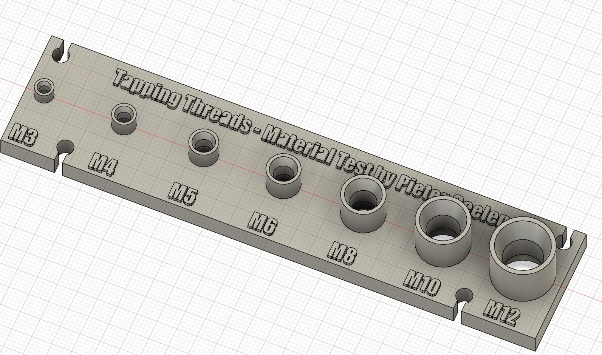

# **3D Printing Tappable Threaded Holes: A Comprehensive Guide with Mathematical Logic**

This document outlines a practical and reliable method for designing and 3D printing holes that can be directly tapped with standard metric screws. This approach focuses on creating precise hole diameters and surrounding geometries that ensure a strong, reliable fit after tapping.

- [**3D Printing Tappable Threaded Holes: A Comprehensive Guide with Mathematical Logic**](#3d-printing-tappable-threaded-holes-a-comprehensive-guide-with-mathematical-logic)
  - [1. Filament Selection and Tapping in General](#1-filament-selection-and-tapping-in-general)
  - [2. The Tapping Process](#2-the-tapping-process)
  - [3. Direct Tapping vs. Threaded Inserts](#3-direct-tapping-vs-threaded-inserts)
  - [4. The Threaded Hole Calculator and Its Logic](#4-the-threaded-hole-calculator-and-its-logic)
    - [4.1 Core Principles: Hole Size Heuristics](#41-core-principles-hole-size-heuristics)
    - [4.2 Clearance Holes](#42-clearance-holes)
    - [4.3 3D Printing Specific Geometries](#43-3d-printing-specific-geometries)
  - [5. Sample Tester](#5-sample-tester)

## 1. Filament Selection and Tapping in General

The ability to create strong, functional threads in 3D-printed parts largely depends on the filament used. For successful direct tapping, it is crucial to use **crystalline filaments** such as **PETG** and **Nylon**. These materials have a more rigid structure that holds the threads well after being cut. Softer, **amorphous filaments** like **PLA** and **TPU** are not recommended for direct tapping, as they can deform and their threads are not very durable.

While direct tapping provides a convenient solution for single-use or low-stress applications, it is important to understand its limitations. Unlike metal, the threads in plastic are substantially weaker and are not suitable for parts that will be screwed and unscreed frequently. For long-term durability and for parts that require constant assembly and disassembly, **threaded inserts** are a much better solution. For example, a popular and robust option are the heat-set inserts from CNC Kitchen.

## 2. The Tapping Process

When tapping directly into a 3D-printed part, the process generates high friction. To ensure a clean and smooth cut without cracking the part, it is highly recommended to use **tapping oil** and perform a **manual, slow cut**. Unlike metal, which can be tapped with power tools, tapping into plastic requires a gentler, more deliberate approach to avoid overheating the material and stripping the fragile threads.

## 3. Direct Tapping vs. Threaded Inserts

| **Method** | **Advantages** | **Disadvantages** | 
 | ----- | ----- | ----- | 
| **Direct Tapping** | - Simplifies CAD design and post-processing. - Can cut threads into a hole of any depth as long as the screw can reach it. | - Threads are less durable and only suitable for low-cycle use. - Not ideal for softer filaments. | 
| **Threaded Inserts** | - Provides a very strong, durable, and reusable threaded hole. - Suitable for high-stress and high-cycle applications. | - Requires a separate heat-set or press-fit operation. - Inserts should ideally be placed on the opposite side of the force for best tensile strength, which is not always possible. | 

## 4. The Threaded Hole Calculator and Its Logic

This entire guide is based on a set of calculated heuristics. To make the process repeatable and easy to implement, a dynamic calculator has been created based on these principles. You can find this online and use it to automatically generate the ideal dimensions for your holes.

### 4.1 Core Principles: Hole Size Heuristics

The most critical factor in creating a tappable hole in plastic is the **initial hole diameter**. This method uses a heuristic of $80\%$ **to** $90\%$ **of the major diameter of the screw** as a starting point.

The **Inner Diameter** for tapping is calculated using the following formula:

$$\text{Inner Diameter} = \text{Major Diameter} \times \frac{\text{Fit Percentage}}{100}$$

The `Fit Percentage` is a user-adjustable parameter between $80\%$ and $90\%$.

| **Screw Size** | **Major Diameter** | **Thread Pitch** | **Inner Diameter (from 80% rule)** | 
 | ----- | ----- | ----- | ----- | 
| M3 | $3$ mm | $0.5$ mm | $2.4$ mm | 
| M4 | $4$ mm | $0.7$ mm | $3.2$ mm | 
| M5 | $5$ mm | $0.8$ mm | $4.0$ mm | 
| ... | ... | ... | ... | 

### 4.2 Clearance Holes

The calculator also provides dimensions for **clearance holes**, which allow a screw to pass through without threading. This is useful for assembling parts where only one side needs to be threaded. The dimensions are calculated as:

* **Close Fit ($+5\%$):** $$\text{Close Fit} = \text{Major Diameter} \times 1.05$$

* **Standard Fit:** A slightly looser fit for easier assembly, typically provided in standard screw dimension tables.

### 4.3 3D Printing Specific Geometries

To ensure successful printing and a durable final part, the calculator helps you determine several other crucial geometric features.

* **Minimal Wall Thickness:** The minimum recommended size for the boss or cylinder that contains the threaded hole. This ensures sufficient material to prevent cracking. The calculation is based on the difference between the Major Diameter and the Inner Diameter (referred to as `Delta`), which is then multiplied by an adjustable `Delta Multiplier` and a `Buffer`.

$$\text{Minimal Wall Thickness} = \text{Inner Diameter} + (\text{Delta Multiplier} \times (\text{Major Diameter} - \text{Inner Diameter})) + \text{Buffer (mm)}$$

* **Chamfer and Minimal Depth:** A **chamfer** at the opening of the hole helps guide the tap and prevents `'elephant's foot'`. The calculator dynamically adjusts the **Minimal Depth** based on the number of **Pitch Depths** you select and the **Chamfer Angle** you specify.

The **Chamfer Base** is determined by the difference between the `Standard Fit` and the `Inner Diameter`:

$$\text{Chamfer Base} = \frac{\text{Standard Fit} - \text{Inner Diameter}}{2}$$

The **Chamfer Height** is then calculated using the `Chamfer Angle` (in degrees) and the `Chamfer Base`:

$$\text{Chamfer Height} = \text{Chamfer Base} \times \tan(\text{Chamfer Angle})$$

Finally, the **Minimal Depth** is calculated as a multiple of the `Thread Pitch`, plus the height of the chamfer:

$$\text{Minimal Depth} = (\text{Pitch Depths} \times \text{Thread Pitch}) + \text{Chamfer Height}$$

## 5. Sample Tester

If you want to test the default format for threaded holes with different filaments, a **sample tester** is available. This tool will be further developed in the future to allow you to customize its parameters, making it easier to test how different settings and filaments perform for your specific needs.

